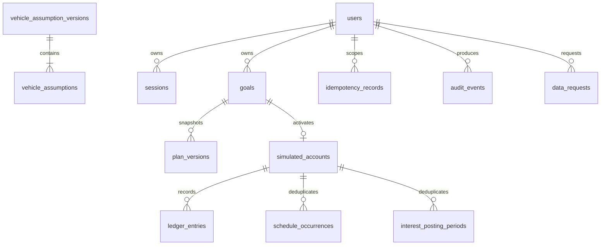
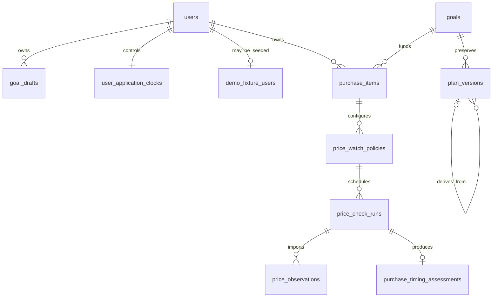

# Local MVP entity relationships

Money columns are `bigint` cents. Goals and every protected child carry an owner predicate. Ledger
entries are append-only by trigger; scheduled occurrences, interest periods, request keys, one active
goal, one account per goal, and plan version numbers are protected by database uniqueness.

## PX target additions

These entities are approved for forward migrations and are not release evidence until the migration
and database tests pass:

`product_events` deliberately has no goal/account/session identifier relationship; it stores only a
pseudonymous reference and closed categorical fields. New owned tables carry user IDs and composite
foreign keys so a child cannot combine resources from different owners. Draft versions use
optimistic concurrency. Plan, observation, event, policy, and assessment history is append-only or
immutable as specified; identical observation/run replay is unique and idempotent.
