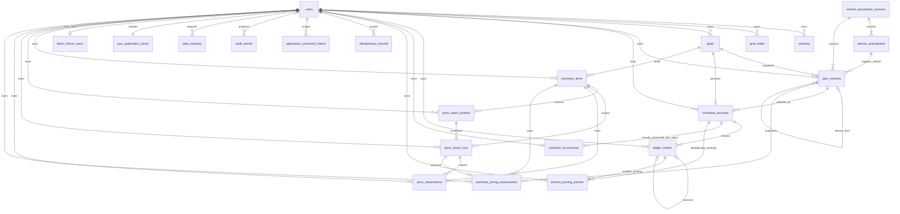

# Current local entity relationships

This diagram reflects the tables and relationships produced by all committed migrations in lexical
order. It is current local schema, not a future migration proposal; exact migration/table/checksum
counts belong in executed release evidence.

Three independent/operational tables are intentionally absent from ownership lines in the diagram:

- `application_clock` is the singleton compatibility/default clock used for anonymous operations
  and seeding. Authenticated browser mutations use `user_application_clocks`.
- `product_events` has no user, goal, item, account, session, or request foreign key. It stores a
  salted pseudonymous subject and closed categorical columns only.
- `schema_migrations` is owned by the ordered migration runner and stores filename, checksum, and
  application time. It is operational inventory, not a product aggregate.

## Integrity boundaries

Money is stored as `bigint` cents; unposted HYSA accrual uses integer micros. Protected children
carry `user_id` and composite foreign keys tying owner and parent together. Database uniqueness
protects one running goal per user, one account per goal, plan version numbers, completed
idempotency responses, in-flight command claims, processed schedule account/date pairs, interest
posting periods, Timing policy/date runs, assessments per run, and observation keys within a run.
Cross-run reuse of an item/source/provider key is serialized and must retain identical date, price,
and currency.

`plan_versions`, vehicle assumptions, price-watch policies, price observations, purchase-timing
assessments, product events, and ledger history have database-enforced immutable or append-only
boundaries appropriate to their lifecycle. `price_check_runs` may make only its constrained claim,
failure, retry, and completion transitions. While claimed, each run has a ULID
`worker_claim_token` and non-null `worker_lease_expires_at`; completed/failed rows require both to
be null. One logical run consumes between one and three attempts. An unexpired generation prevents
duplicate provider work, expiry permits a new-token attempt on the same row, and repository
completion/failure requires the matching current token. Purchase-item updates are
optimistic-versioned and may change only target price or lifecycle; goal archive rows require
`archived_at` and one of `USER_REQUESTED`, `GOAL_COMPLETED`, or `NO_LONGER_PURSUED`.

Every current `plan_versions.calculation_context` is non-null and schema-checked; the provenance
limit for contexts reconstructed from pre-context rows is documented in
[ARCHITECTURE.md](../ARCHITECTURE.md).
The same document records migration-011 compatibility fallbacks for legacy archive fields and
price-observation keys.

At most one ledger reversal may exactly negate an `account_opened`, `contribution_posted`, or
`interest_posted` credit in the same account; a reversal or non-credit activity cannot be reversed.
The reversal trigger locks that simulated account before validating its source. Available
fixed-term balances exclude reversed source lots and include the effect of maturity-interest
reversals.

`simulated_accounts.status` uses its existing terminal `completed` value when any goal is archived,
and `next_contribution_date` is cleared. The API read model joins goal archive provenance: a
`USER_REQUESTED` or `NO_LONGER_PURSUED` archive is presented as account-summary `archived` with its
actual progress, while a `GOAL_COMPLETED` archive remains completed and 100%. There is no falsely
persisted future `archived` account row.

Draft activation stores the plan's schedule anchor and the simulated account's next contribution
date. Future contribution dates are derived when needed; they are **not** pre-populated in
`schedule_occurrences`. That table contains processed due dates only.

`application_command_claims` represents an in-flight application command, not a completed replay.
On successful completion it is replaced by an `idempotency_records` response. An indeterminate
claim stays fail-closed until a caller can prove the operation did not commit and explicitly marks
it retryable.

`user_application_clocks` also stores the distinct Story financial-run token/expiry pair. Both are
null when unclaimed; otherwise the token is a ULID and the expiry is non-null. This ten-minute
owner lease serializes Story advance against guarded plan/account mutations, supports stale-expiry
reclaim, and permits release only by the matching current token. It is not a future schedule row or
an `application_command_claims` replacement.

The per-run provider-worker fields above form a third, narrower coordination boundary: they lease
only one Timing provider import generation and do not serialize Story financial changes or persist
an HTTP response replay.

The HYSA interest revision is computed rather than persisted as another schema row: processing-date
ledger balance/count plus locked account accrual state, goal version/target, and current plan
pointer. Future-effective ledger rows are excluded from an earlier revision; the per-user milestone
query exposes the greatest persisted account/ledger date beyond the clock as a recovery high-water
date.
