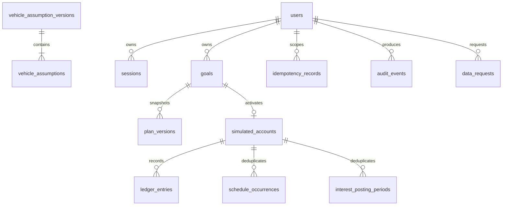

# Local MVP entity relationships

Money columns are `bigint` cents. Goals and every protected child carry an owner predicate. Ledger
entries are append-only by trigger; scheduled occurrences, interest periods, request keys, one active
goal, one account per goal, and plan version numbers are protected by database uniqueness.
